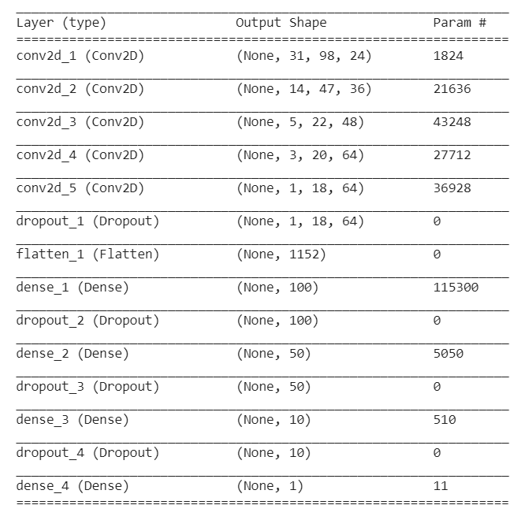
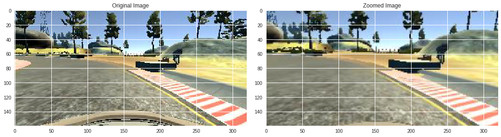
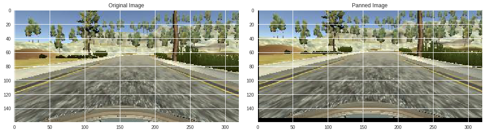
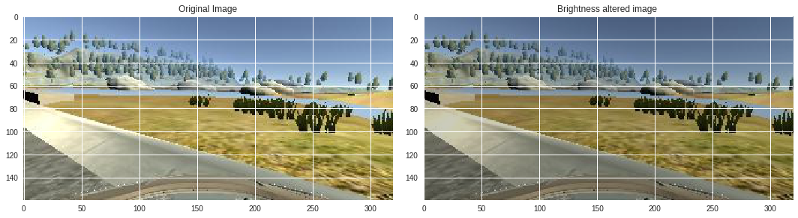
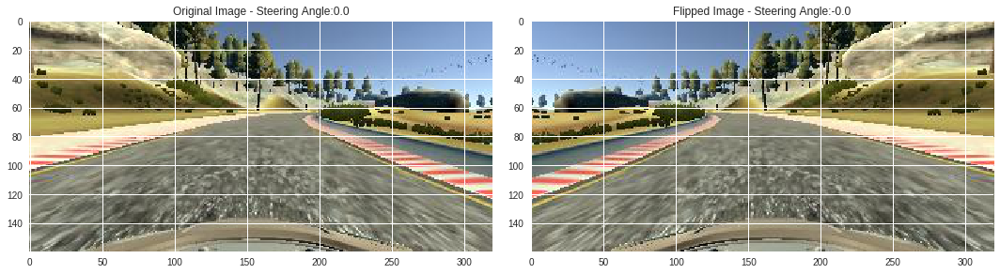

# **Behavioral Cloning** 

## Writeup 

**Behavioral Cloning Project**

The goals / steps of this project are the following:
* Use the simulator to collect data of good driving behavior
* Build, a convolution neural network in Keras that predicts steering angles from images
* Train and validate the model with a training and validation set
* Test that the model successfully drives around track one without leaving the road
* Summarize the results with a written report


[//]: # (Image References)

[image1]: ./examples/placeholder.png "Model Visualization"
[image2]: ./examples/placeholder.png "Grayscaling"
[image3]: ./examples/placeholder_small.png "Recovery Image"
[image4]: ./examples/placeholder_small.png "Recovery Image"
[image5]: ./examples/placeholder_small.png "Recovery Image"
[image6]: ./examples/placeholder_small.png "Normal Image"
[image7]: ./examples/placeholder_small.png "Flipped Image"

## Rubric Points
### Here I will consider the [rubric points](https://review.udacity.com/#!/rubrics/432/view) individually and describe how I addressed each point in my implementation.  

---
### Files Submitted & Code Quality

#### 1. Submission includes all required files and can be used to run the simulator in autonomous mode

My project includes the following files:
* model.py containing the script to create and train the model
* drive_updated.py for driving the car in autonomous mode
* model.h5 containing a trained convolution neural network 
* writeup.md summarizing the results

#### 2. Submission includes functional code
Using the Udacity provided simulator and my drive_updated.py file, the car can be driven autonomously around the track by executing 
```sh
python drive_updated.py
```

#### 3. Submission code is usable and readable

The model.py file contains the code for training and saving the convolution neural network. The file shows the pipeline I used for training and validating the model, and it contains comments to explain how the code works.

### Model Architecture and Training Strategy

#### 1. An appropriate model architecture has been employed

My model consists of convolutional neural network with some 5x5 filters and some 3x3 filters. 
I started with Relu activation function but later changed to elu activation since I had some issues with dead relu cause training and validation losses were not converging.
I added my own image preprocessing function which included cropping image to appropriate height, changing image to YUV color format, adding Gaussian Blur, and then normalization.

#### 2. Attempts to reduce overfitting in the model

I have added 	***Dropout*** layers to reduce overfitting. Also later I added data augmentation which also helps in overfitting.

#### 3. Model parameter tuning

The model used an adam optimizer, so the learning rate was not tuned manually. I started with learning rate as 1e-3 and let the model train.

#### 4. Appropriate training data

At first I only ran a couple of tracks on first track and collected the data. Later I read online that this might induce some left side bias since the track makes car turn left all the time. So I collected more data by running reverse in the track, the same number of times I ran in the other direction.

### Model Architecture and Training Strategy

#### 1. Solution Design Approach

The overall strategy was to start with NVIDIA model as baseline and then updated based on the amount of data and what result I get by testing.
I started with a convolutional model using NVidia model as reference. All layers had `relu` as activation. Added `Adam` as optimizer with `learning_rate` as `1e-3` and loss as `mean squared error`. Since we're predicting the steering angle, this problem is not a classification problem but a regression problem hence mean squared error as loss function.
First model didn't have any batch generation data and no augmentation also. 
First run of the model saw more or less no change of losses across epochs. Also graph show that the model is poorly trained or **underfit** since the difference between training and validation loss never seems to come closer.
Dead `relu` might be the reason for this happening.
Then I updated the model. Changing to `elu` activation seems to be effective as the graphs show convergence. But it shows small indication of **overfitting** near the end of the training process.
So in the third iteration I added some ***dropout*** layers and that does the trick. Model looks good.

#### 2. Final Model Architecture

The final model architecture is a resemblance of nvidia model. It is as shown below:



#### 3. Creation of the Training Set & Training Process

To capture good driving behavior, I first recorded three laps on track one using center lane driving. Then I recorded three laps in the reverse direction of the same track to avoid any bias towards left side moving.

Along the way I also intentionally recorded some data where the vehicle recovers from left and right side of the road back to the center so that the vehicle would learn to always be centered while driving.
I didn't train on track cause I wanted to test on that track even though that track looks more challenging but I added data augmentation in the images for first track by adding zoom, pan, brightness change, flipping augmentation techniques, this helps in generating more data.






I also added randomness to the dataset so that the training process is more general.